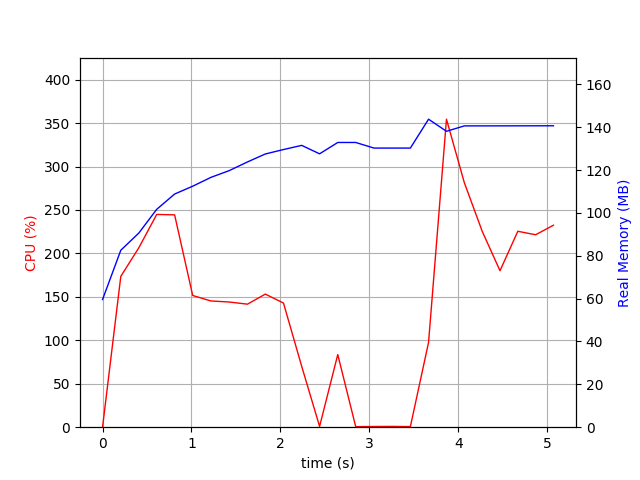

# Java Docker Images

Repository to test different JVM.

Project structure:

* *hello-app*: Spring Boot app with simple REST controller.
* *test-results*: Output from the tests.
* *monitored_ab_stress.sh*: Script to run a given command, attach a monitoring tool to the process  and run Apache Bench test against a given URL.

The result folde for each one contains:

* ApacheBench output
* Application log (to see the startup time taken)
* `psrecord` output and graph
* file with version of the JVM

## Setup

Install the JDKs using [Jabba](https://github.com/shyiko/jabba).

```
jabba install adopt@1.11.0-6
jabba install adopt-openj9@1.11.0-6
jabba install zulu@1.11.0-6
jabba install amazon-corretto@1.11.0-6.10.1
jabba install graalvm@19.3.1
```

## Build the App

First build the app with: `sh build_app.sh`.

Test the app: `curl http://localhost:8080/greetings`

## JVMs

Environments variables:

* JAVA11_HOME: HotSpot 11
* JAVAo11_HOME: OpenJ9 11
* JAVAg11_HOME: GraalVM 11
* JAVAz11_HOME: Zulu 11
* JAVAc11_HOME: Amazon Corretto 11

## Partial Results

### HotSpot 11

```
java version "11.0.1" 2018-10-16 LTS
Java(TM) SE Runtime Environment 18.9 (build 11.0.1+13-LTS)
Java HotSpot(TM) 64-Bit Server VM 18.9 (build 11.0.1+13-LTS, mixed mode)
```

#### Vanilla

```
Time to start the server: 4 s
Total CPU time used at startup: 16040 s
Time to finish the test: 3 s
```


#### CDS

```
Time to start the server: 4 s
Total CPU time used at startup: 16570 s
Time to finish the test: 2 s
```


### OpenJ9 11

```
openjdk version "11.0.6" 2020-01-14
OpenJDK Runtime Environment AdoptOpenJDK (build 11.0.6+10)
Eclipse OpenJ9 VM AdoptOpenJDK (build openj9-0.18.1, JRE 11 Mac OS X amd64-64-Bit Compressed References 20200122_450 (JIT enabled, AOT enabled)
OpenJ9   - 51a5857d2
OMR      - 7a1b0239a
JCL      - da35e0c380 based on jdk-11.0.6+10)
```

#### Vanilla

```
Time to start the server: 5 s
Total CPU time used at startup: 11770 s
Time to finish the test: 3 s
```


#### [AOT](https://www.eclipse.org/openj9/docs/aot/)

```
Time to start the server: 2 s
Total CPU time used at startup: 3570 s
Time to finish the test: 1 s
```


#### [AOT](https://www.eclipse.org/openj9/docs/aot/) and [JIT](https://www.eclipse.org/openj9/docs/jit/)

```
Time to start the server: 2 s
Total CPU time used at startup: 3400 s
Time to finish the test: 1 s
```



### Zulu 11

```
openjdk version "11.0.6" 2020-01-14 LTS
OpenJDK Runtime Environment Zulu11.37+17-CA (build 11.0.6+10-LTS)
OpenJDK 64-Bit Server VM Zulu11.37+17-CA (build 11.0.6+10-LTS, mixed mode)
```

#### Vanilla

```
Time to start the server: 4 s
Total CPU time used at startup: 15820 s
Time to finish the test: 2 s
```


#### CDS

```
Time to start the server: 4 s
Total CPU time used at startup: 14540 s
Time to finish the test: 1 s
```


### Amazon Correto 11

```
openjdk version "11.0.6" 2020-01-14 LTS
OpenJDK Runtime Environment Corretto-11.0.6.10.1 (build 11.0.6+10-LTS)
OpenJDK 64-Bit Server VM Corretto-11.0.6.10.1 (build 11.0.6+10-LTS, mixed mode)
```

#### Vanilla

```
Time to start the server: 3 s
Total CPU time used at startup: 15620 s
Time to finish the test: 1 s
```


#### CDS

```
Time to start the server: 4 s
Total CPU time used at startup: 15640 s
Time to finish the test: 1 s
```


## TODO

* [x] HotSpot VM 11
* [x] OpenJ9 VM 11
* [x] Zulu VM 11
* [x] Amazon Corretto
* [ ] GraalVM 11
* [ ] Increase the load

## Links

* [OpenJ9](https://www.eclipse.org/openj9/)
* [OpenJ9 CDS](https://developer.ibm.com/components/java-platform/tutorials/j-class-sharing-openj9)
* [GraalVM](https://www.graalvm.org/)
* [Zulu VM](https://www.azul.com/downloads/zulu-community)
* [Amazon Corretto](https://aws.amazon.com/pt/corretto/)
